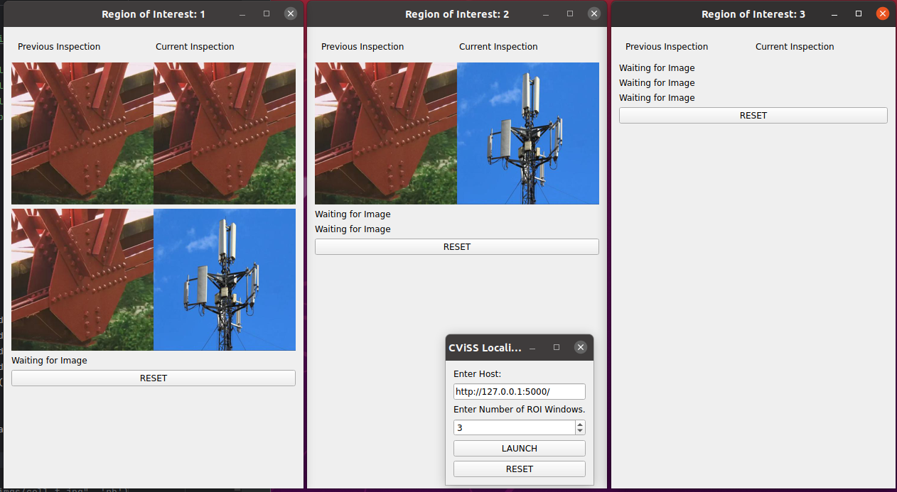

# GUI for Localization Server

Displays several localized patches for each region of interest (ROI)
from the localization server. 

## Architecture

This program has two components...

1. Flask Server
   1. Receives API call from localization server (idx, Q, R, q, r)
   2. Stores and Serves localization results to PYQT5 GUI
2. PYQT5 GUI
   1. Communicates with Flask server
   2. Retrieve and display localization results

## Using the GUI
1. Run app.py (Flask Server)
   1. Change the host as required.
   2. Ensure localization server can reach the app route host/visualize
   3. See sendquery.py for sample request
2. Run gui.py (PYQT5 GUI)
   1. Make sure to enter the correct host of the Flask server.
   2. Select the number of ROI windows to open.
   3. Press 'LAUNCH'. Please note that you will not be able to press
   launch again without first pressing 'RESET', which will close all windows

## Example Usage

### Main Screen (PYQT5 GUI)

### ROI Screens

The ROI number corresponds to the idx from Localization Server which we assume
are Natural Numbers (i.e., 1, 2, 3 ...)

### Reset ROI Screen

Pressing the RESET button on the ROI screen will blank the currently displayed ROIs.
Below is the result of pressing RESET in ROI: 1 screen...

## Limitations

* app.py utilizes a very crude database for storing images from the localization server.
  * images are stored as PIL Image objects, where the latest is retrieved but previous
  images are not erased. This can lead to memory issues if app.py
  is running for an extended period of time.
* PYQT5 GUI periodically checks for new images from Flask server.
  * There should be some kind of trigger that can be used.
* The ROI screen only has room for 3 pairs of images. 
  * There should be a way to add scroll functionality.
  * Checking the aspect ratio would be good.
  * Also zoom on hover should also be implemented.